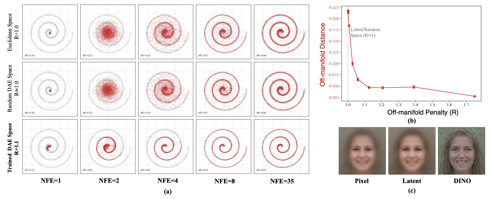

<div align="center">

# Perceptual Flow Matching for Few-Step Generative Modeling

<p>
  <strong>
    Chuyang Zhao<sup>1</sup>&nbsp; Yifei Song<sup>2</sup>&nbsp; Hongfa Wang<sup>3</sup>&nbsp; Jianlong Yuan<sup>1</sup>&nbsp;
    Yuan Zhang<sup>1</sup>&nbsp; Siming Fu<sup>1</sup>&nbsp; Zhineng Chen<sup>2</sup>&nbsp; Huilin Deng<sup>4</sup>&nbsp; Haoyang Huang<sup>1</sup>&nbsp; Nan Duan<sup>1</sup>†
  </strong>
</p>

<p>
  <sup>1</sup>Joy Future Academy&nbsp;&nbsp;
  <sup>2</sup>Fudan University&nbsp;&nbsp;
  <sup>3</sup>Tsinghua University&nbsp;&nbsp;
  <sup>4</sup>USTC
</p>

<p>
  <a href="https://arxiv.org/abs/2607.03524v1"></a>&nbsp;
  <a href="https://huggingface.co/papers/2607.03524"></a>&nbsp;
  <a href="https://github.com/ZhaoChuyang/PFM"></a>
</p>

</div>

## 📰 News
- [2026/07/23] We release the training and inference code and checkpoints of PFM on SD3.

## Introduction

We propose Perceptual Flow Matching (PFM) — a simple framework for few-step generation in flow-matching models. By supervising flow matching in a perceptual feature space instead of the conventional VAE latent space, PFM reduces sampling steps from 35–50 to 4–8 while preserving generation quality.

<p align="center">
  
</p>


## Usage

### Environment Setup

```bash
conda create -n pfm python=3.10 -y
conda activate pfm

pip install -r requirements.txt
```

### Training

| Task | Dataset | LoRA | Perceptual Model | Backbone | GFT Scale | Script |
|------|---------|------|-----------------|----------|-----------|--------|
| T2I | COCO | ✗ | VGG+DINO | SD3-Medium | 1.0 | [train_sd3_coco_vgg+dino.sh](scripts/train_sd3_coco_vgg+dino.sh) |
| T2I | COCO | ✓ | VGG+DINO | SD3-Medium | 2.0 | [train_sd3_lora_coco_vgg+dino.sh](scripts/train_sd3_lora_coco_vgg+dino.sh) |
| T2I | COCO | ✗ | ConvNeXt+CLIP+DINO | SD3-Medium | 3.5 | [train_sd3_coco_clip+dino+convnext.sh](scripts/train_sd3_coco_clip+dino+convnext.sh) |


### Inference

```bash
cd /path/to/PFM
export PYTHONPATH=$PYTHONPATH:$(pwd)

torchrun --nproc_per_node=8 pfm/eval_sd3.py \
    --checkpoint /path/to/checkpoint/step_500.pth \
    --val_prompts_file evaluations/PartiPrompts.jsonl \
    --sampling_methods consistency \
    --num_steps 4,8 \
    --output_dir outputs/sd3_pfm/eval \
    --max_samples 64
```

## Acknowledgements

Based on [HunyuanVideo](https://github.com/Tencent-Hunyuan/HunyuanVideo-1.5), [JoyAI-Image](https://github.com/jd-opensource/JoyAI-Image), [FastVideo](https://github.com/hao-ai-lab/fastvideo)

## Contact

For any questions, please contact [Chuyang Zhao](mailto:chuyang.zhao@outlook.com)(chuyang.zhao@outlook.com).

We are hiring interns at [JoyAI Research](https://research.joyai.com/). If you are interested, please send your resume to [zhaochuyang.3@jd.com](mailto:zhaochuyang.3@jd.com).

## License

This project is released under the [Apache-2.0](LICENSE) license.